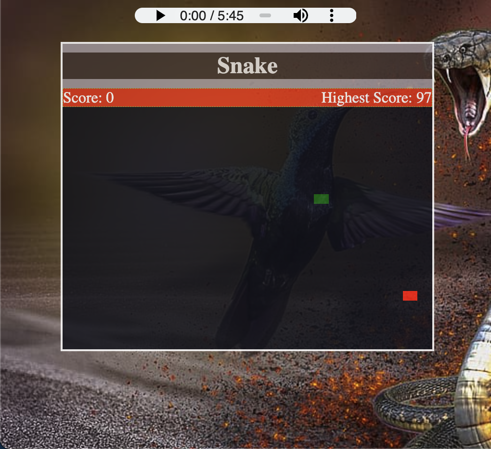

# **_Snake_**

## Date: 5/4/2023

### By: Jeremy Cox

[LinkedIN](https://www.linkedin.com/in/jeremy-cox-/)
[GitHub](https://www.github.com/remifreyo/Snake)

---

### **_Description_**

##### Snake is a game where the player manuevers the end of a growing line themed as a snake. The player must keep the snake from colliding with the edge of the board and himself. This version of the classic game was built using HTML, CSS, and Javascript

---

### **_Technologies_**

- VSCode
- HTML
- CSS
- Javascript

---

### **_Screenshots_**

---

### **_Future Updates_**

- [x] ~~Add a new layer of difficulty by making Snake increase in speed as the game goes on~~
- [x] ~~Build Wireframe~~
- [x] ~~Create ReadMe~~
- [x] ~~Write Psuedo Code~~

---

### **_Credits_**

https://www.youtube.com/watch?v=K8Rh5x3c9Pw&t=1442s
https://www.youtube.com/watch?v=8mRY70ot_n4&t=3862s
